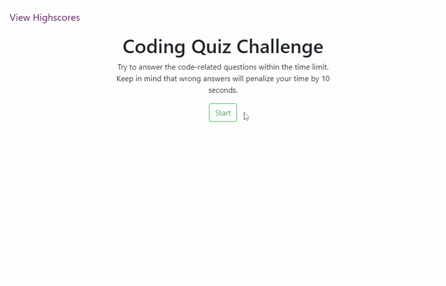

# 4-Code-Quiz

This assignment was meant to develop a multiple choice quiz. The quiz features dynamically updated HTML and CSS powered by Javascript code. The interface is clean and responsive. The quiz stores the highest score in the local storage. The quiz is supposed to satisfy the following criteria.

## Acceptance Criteria

```
GIVEN I am taking a code quiz
WHEN I click the start button
THEN a timer starts and I am presented with a question
WHEN I answer a question
THEN I am presented with another question
WHEN I answer a question incorrectly
THEN time is subtracted from the clock
WHEN all questions are answered or the timer reaches 0
THEN the game is over
WHEN the game is over
THEN I can save my initials and score
```


The quiz is deployed at https://26rsuarez.github.io/4-Code-Quiz/

